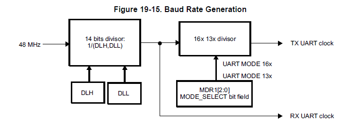
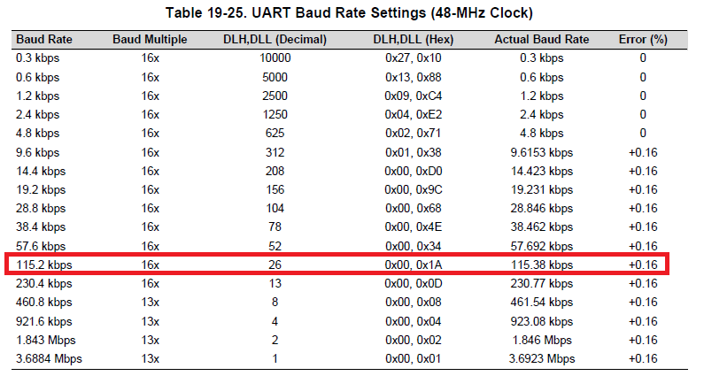
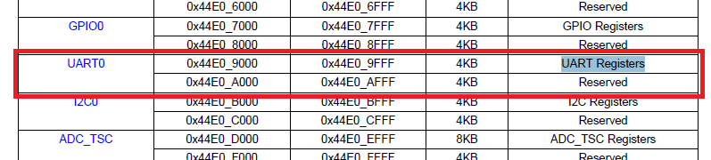
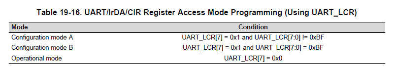
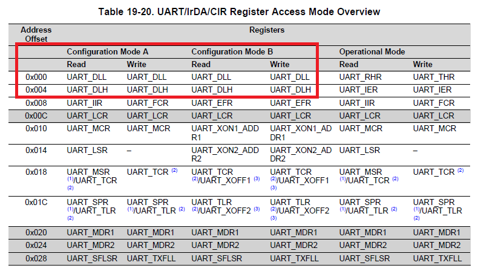
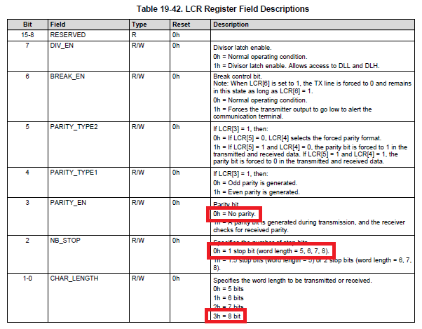
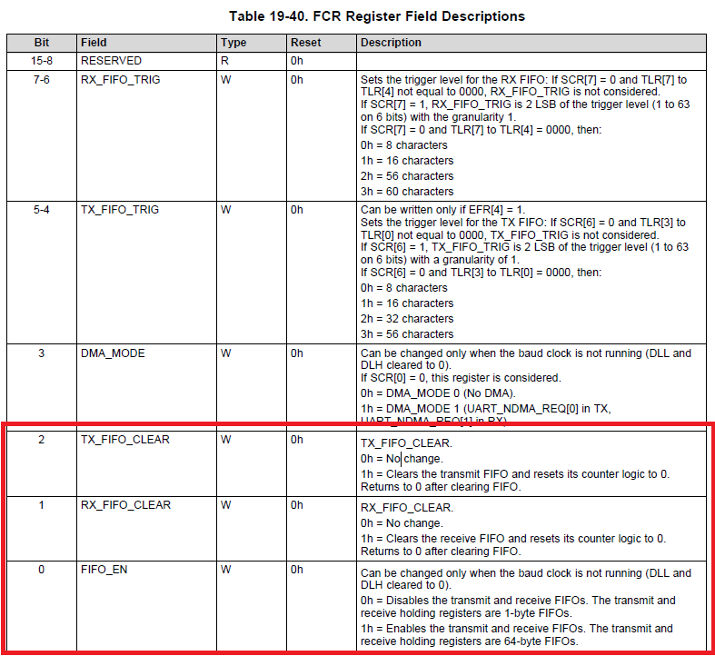
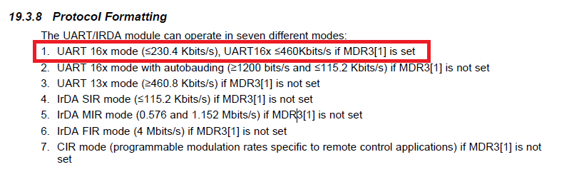

# UARTの初期化値

UARTについては以下の項目が設定されていれば良い

|項目名|値|
|:---|:---|
|ボーレート|115200bps|
|データビット数|8bit|
|パリティビット|なし|
|ストップビット|1bit|


# ボーレートの設定方法

ボーレートは48MHzを分周してつくられる。



レジスタDLHとDLLを設定する事で、任意のボーレートに設定できる。
レジスタの値とその時のボーレートの対応関係は以下の図に示されている。



今回は115200bpsのため、`DLH=0x00`、`DLL=0x26`を設定すればよい。

ここで、DLH,DLLレジスタへのアクセス方法を調査すると

「**19.3.7.1.1 Operational Mode and Configuration Modes**」に以下のような説明がある。

* UARTのベースレジスタは以下の通り

* レジスタアクセスには以下のようなモードがある
    * Operation mode
    * Configuration mode A
    * Configuration mode B
* レジスタのアクセスモードは以下のような方法で変更できる

* レジスタのアクセスモードに応じて内容が切り替わるレジスタは以下の通り


これらのことからConfigurationモードを変更した後に、`DLH`,`DLL`を変更すれば良いことがわかる。

具体的なコードは以下の通り

```C
#define	dll	buffer
// bufferレジスタをdllレジスタに読み替えている
// bufferレジスタとはマニュアルのRHRレジスタ(Receiver Holding Register)のこと
// lcrレジスタの「8bit目が1かつ8-1bit目が0xBF」でない場合Operation mode Aとなり
// UART Registerのアドレス0x00はRHRでなく、DLLとなる
// lcr = 0x80;実施後、dllでアクセスする

#define	dlm	ier
// おそらく、dlmでなくdlhの間違い
// ierレジスタとはIER_UARTレジスタのこと
// lcrレジスタの「8bit目が1かつ8-1bit目が0xBF」でない場合Operation mode Aとなり
// UART Registerのアドレス0x00はIERでなく、DLHとなる


/* Initialize the UART */
uptr = (struct uart_csreg *)0x44e09000;

/* Set baud rate */
uptr->lcr = UART_LCR_DLAB; // = 0x80(Operation mode A)
uptr->dlm = UART_DLM; // = 0
uptr->dll = UART_DLL; // = 26

```

## データビット数、パリティビット、ストップビットの設定方法



```C
#define	UART_LCR_8N1	0x03

uptr->lcr = UART_LCR_8N1;       /* 8 bit char, No Parity, 1 Stop*/
```
## 送信バッファと受信バッファのクリア

FIFOを有効にし、送信バッファと受信バッファをクリアします。



```C
uptr->fcr = UART_FCR_EFIFO | UART_FCR_RRESET | UART_FCR_TRESET;
```

## プロトコルフォーマット

プロトコルを選択します。`UART 16x mode`を選択します。



```C
uptr->mdr1 = UART_MDR1_16X;
```


# 方針

* uartの資料調査について
* uartとttyの違いについて
* Startupコードについて
* Makefileについて
* コンパイルオプションについて