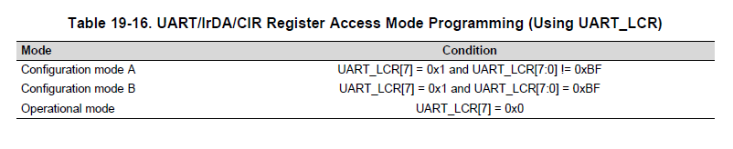
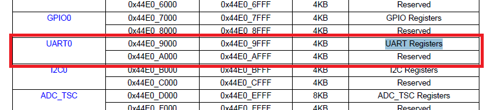
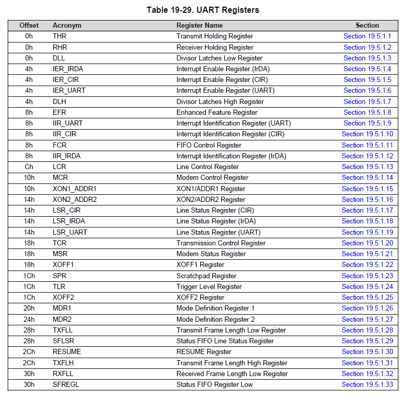
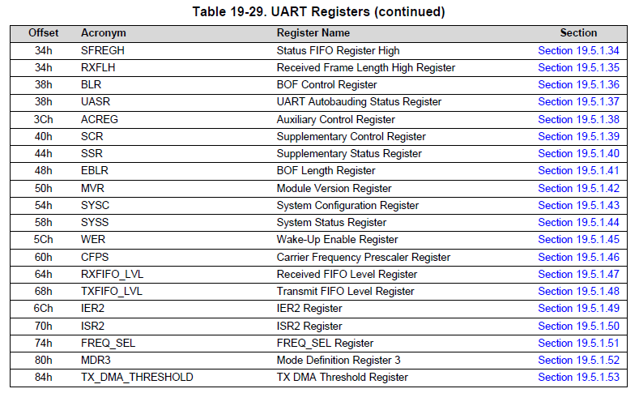

# 方針

* uartの資料調査について
* uartとttyの違いについて
* Startupコードについて
* Makefileについて
* コンパイルオプションについて

## UARTの初期化値

|項目名|値|
|:---|:---|
|ボーレート|115200bps|
|データビット数|8bit|
|パリティビット|なし|
|ストップビット|1bit|

## 初期化手順


```C
#define	dll	buffer
// bufferレジスタをdllレジスタに読み替えている
// bufferレジスタとはマニュアルのRHRレジスタ(Receiver Holding Register)のこと
// lcrレジスタの「8bit目が1かつ8-1bit目が0xBF」でない場合Operation mode Aとなり
// UART Registerのアドレス0x00はRHRでなく、DLLとなる
// lcr = 0x80;実施後、dllでアクセスする

#define	dlm	ier
// おそらく、dlmでなくdlhの間違い
// ierレジスタとはIER_UARTレジスタのこと
// lcrレジスタの「8bit目が1かつ8-1bit目が0xBF」でない場合Operation mode Aとなり
// UART Registerのアドレス0x00はIERでなく、DLHとなる


/* Initialize the UART */
uptr = (struct uart_csreg *)0x44e09000;

/* Set baud rate */
uptr->lcr = UART_LCR_DLAB; // = 0x80(Operation mode A)
uptr->dlm = UART_DLM; // = 0
uptr->dll = UART_DLL; // = 26

```


## UARTに関するレジスタについて調べよう

### レジスタアクセスモード

#### 「19.3.7.1.1」Operational Mode and Configuration Modes」について

レジスタアクセスはレジスタアクセスモードに依存します。
モードは以下の３つがあります
* Operational Mode:このモードではデータ転送が可能です
* Configuration mode A/B:モジュールの初期化ステップで使用されます。Operational Modeでは画されているレジスタにアクセスできます



ARM Cortex-A8のメモリマップ(Table 2-1. L3 Memory Map)を調べると以下のような記述がある。



ARM Cortex-A8ではメモリアドレス`0x44E09000`から開始4KBの領域がUART0のレジスタに割り当てられている。

UART Registerの詳細は以下の通り。




