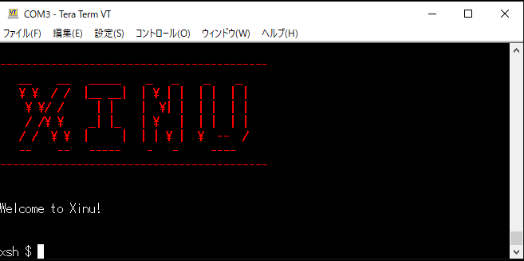

# XinuOS

## 実行環境

* wsl 18.04

## 準備物

* BBB
* USBシリアルケーブル
* microSDカード


## ブートローダービルドの手順と成果物

### 手順

* `gcc-arm-linux-gnueabi`のインストール
```
gcc-arm-linux-gnueabi
```
* ブートローダーリポジトリのダウンロード
```
git clone git://git.denx.de/u-boot.git
```
* ビルド(フォルダ内で実行する)
```
make -j8 ARCH=arm CROSS_COMPILE=arm-linux-gnueabi- distclean
make -j8 ARCH=arm CROSS_COMPILE=arm-linux-gnueabi- am335x_evm_config
make -j8 ARCH=arm CROSS_COMPILE=arm-linux-gnueabi-
```

### 成果物

* MLO
* u-boot.img

## 本体ビルドの手順と成果物

### 手順

* armのクロスコンパイラ環境をインストールする
    * 『[ARMのGCCコンパイル環境を構築する](https://www.yokoweb.net/2018/03/07/wsl-ubuntu-arm-gcc/)』を実施する
    * プロジェクトにもcross-compilerがついているが、実行形式が32bit版のため実行できない
* 本体プロジェクトをダウンロードする
    * <方法1>安定版:本家のリンク[An ARM version (BeagleBone Black board from TI)](https://www.cs.purdue.edu/homes/comer/downloads/Xinu_Book_And_Code/BeagleBoneBlack/Xinu-BeagleBoneBlack.tar.gz)からダウンロードする
    * <方法2>最新版:github版[real-xinu/xinu-bbb](https://github.com/real-xinu/xinu-bbb)からダウンロードする
* ソースの修正:ethernet関係のソースがうまく動作しないので、その処理をコメントアウトする
    * `device/eth/ethinit.c`のethinit()関数の中身をすべて削除
    * `system/initialize.c`
        * `nulluser()`関数内の`net_init();`をコメントアウト
        * `startup()`関数内のdhcp関係のソースをすべてコメントアウト
* Makefileを修正する
    * コンパイラの修正(同梱の実行できないものではなく、インストールしたものを指定するように変更する)
```
  #########################################################################
  #									#
  #									#
  #  Makefile for Beaglebone Black version of the Xinu operating system	#
  #									#
  #  includes: .deps and .defs						#
  #									#
  #									#
  #########################################################################
  
- COMPILER_ROOT	=	../cross_compiler/bin/arm-none-eabi-
+ COMPILER_ROOT	=	arm-none-eabi-
  PNAME		=	bbb
  PLAT		=	Platform_$(PNAME)
  TOPDIR		=	..
```
* mkimageの再配置
    * `uboot-tool`配下の`mkimage`もarch違いにより実行できないため、削除し、前段階で環境作成時に生成されている`mkimage`をコピーして配置する
* ビルド
    * `compile`フォルダで`make`を実行し、『`xinu`』が生成されれば成功


### 成果物

* xinu(.binではないほう)

## microSDCardの作成手順

* FAT32でフォーマットする(SD Fommatterでもよい)
* 以下の物を入れる
    * MLO(ブートローダービルドで作成済)
    * u-boot.img(ブートローダービルドで作成済)
    * xinu.boot(本体ビルドで作成したxinuをxinu.bootにリネーム)
    * uEnv.txt(テキストで以下のように作成)
```
bootfile=xinu.boot 
boot_mmc=fatload mmc 0 0x80200000 ${bootfile}; bootm 
uenvcmd=run boot_mmc
```

## 結果

以下のようにコンソールに大きくXinuの文字が出れば成功。シェルが起動しているので、echoコマンドなどが実行できる


### 参考資料

* [XinuBBB](https://github.com/jarrocha/XinuBBB)
* [Getting started with Embedded Xinu](https://github.com/xinu-os/xinu/blob/master/docs/Getting-Started.rst)]
* [Beagleboard:Main_Page](https://elinux.org/Beagleboard:Main_Page)
* [Debugging U Boot errors on the BeagleBone Black rev C](https://www.reddit.com/r/osdev/comments/tgdm2y/debugging_u_boot_errors_on_the_beaglebone_black/):ethernet関係のソースがあると起動しない問題について
